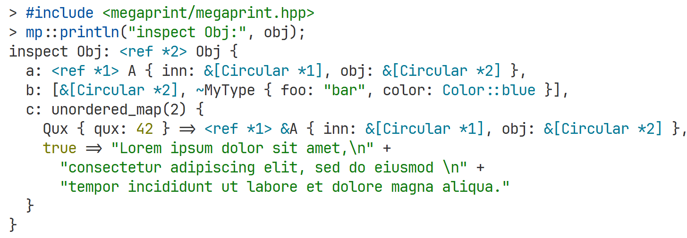

<h1 align="center">megaprint.hpp</h1>

<p align="center">
  Including <code>megaprint.hpp</code> makes <i>pretty printing <b>everything</b></i> easy and fun!
</p>

<p align="center">
  <a href="https://wikipedia.org/wiki/C%2B%2B20">
    
  </a>
  <a href="https://github.com/Snowflyt/megaprint.hpp/blob/main/LICENSE">
    
  </a>
</p>



## Highlights

- **Header-only** library. Grab a copy of `include/megaprint/megaprint.hpp` and include it in your project.
- Very **easy to use**. Just call `mp::println(...)` with your data like you call `print` in Python or `console.log` in JavaScript, and it will print everything in a pretty format.
- Inspect [aggregate types](https://en.cppreference.com/w/cpp/language/aggregate_initialization) with **field names**, enumerations with **enum names**, and **various STL types** including **smart pointers**, `std::vector`, `std::unordered_map`, `std::tuple`, `std::variant`, and more.
- **Human-readable** results with **auto indentation** and **line breaking** for long outputs, **ANSI color** support, and **circular references** displayed with a **reference pointer** (e.g., `<ref *1> Foo { foo: Bar { bar: [Circular *1] } }`).
- Highly **customizable options** for inspecting, indentation, line breaking, colors, user-defined types, and more.

## Quick Start

**megaprint** is a single-header C++ 20 library. To start, make sure you have a compiler that supports C++ 20. GCC ≥ 11, Clang ≥ 12, and MSVC ≥ 2022 have been tested to work.

- The simplest way to use **megaprint** is to grab the single header file `include/megaprint/megaprint.hpp` and include it in your project.
- Alternatively, you can use [CPM.cmake](https://github.com/cpm-cmake/CPM.cmake) to add megaprint as a dependency in your CMake project:

  ```cmake
  include(CPM.cmake)
  CPMAddPackage("gh:Snowflyt/megaprint.hpp@0.1.1") # or above
  target_link_libraries(your_target_name PRIVATE megaprint::megaprint)
  ```

- If you want, you can also clone the repository and install it globally for convenience (typically in `/usr/local/include` on Unix-like systems):

  ```bash
  git clone https://github.com/Snowflyt/megaprint.hpp.git
  cd megaprint.hpp
  cmake -S . -B build
  cmake --build build --target install
  ```

After installation, you can include **megaprint** in your C++ files like this:

```cpp
#include <string>

#include <megaprint/megaprint.hpp>

struct Person {
  std::string name;
  int age;
};

int main() {
  int x = 42;
  std::string str = "Hello, megaprint!";
  mp::println("x:", x, "str:", str);

  Person person{"Alice", 30};
  mp::println("person:", person);

  return 0;
}
```

The output would look like this (with ANSI colors if supported):

```text
x: 42 str: Hello, megaprint!
person: Person { name: "Alice", age: 30 }
```

**megaprint** provides three main functions for printing:

- `mp::print(...)`: Prints the arguments without a newline at the end.
- `mp::println(...)`: Prints the arguments with a newline at the end.
- `mp::inspect(value, options...) -> std::string`: Returns a string representation of the value with optional formatting options (from the `mp::option::` namespace).

`mp::print(...)` and `mp::println(...)` accept variadic arguments and cannot accept options directly. You can change their behavior by modifying the global default options using `mp::set_options(...)`.

On the other hand, `mp::inspect` accepts a single value and optional formatting options, allowing you to customize the output without affecting the global settings. `mp::inspect` can also be useful when you do not want to print directly to the console but rather obtain a formatted string representation of a value, e.g., when formatting error messages.

For example, to print a `std::vector` with forced line breaking, 4-space indentation, and forced trailing commas, you can either achieve this by setting the global options:

```cpp
#include <vector>

#include <megaprint/megaprint.hpp>

int main() {
  mp::set_options(
    mp::option::break_length{0},
    mp::option::indent{4},
    mp::option::trailing_comma{mp::option::trailing_comma_type::always}
  );

  std::vector<int> vec = {1, 2, 3, 4, 5};
  mp::println(vec);

  return 0;
}
```

... or by using `mp::inspect` with the same options:

```cpp
#include <vector>
#include <iostream>

#include <megaprint/megaprint.hpp>

int main() {
  std::vector<int> vec = {1, 2, 3, 4, 5};
  std::cout << mp::inspect(vec,
    mp::option::break_length{0},
    mp::option::indent{4},
    mp::option::trailing_comma{mp::option::trailing_comma_type::always}
  ) << std::endl;

  return 0;
}
```

The output will be:

```text
[
    1,
    2,
    3,
    4,
    5,
]
```

> [!NOTE]
>
> By default, `mp::inspect` does not enable ANSI colors and multiline output like `mp::print(...)` and `mp::println(...)` do, nor does it respect the global options set by `mp::set_options(...)`. This design choice is intentional to avoid unexpected behavior when using `mp::inspect` in contexts where you might not want the global options to apply.
>
> To invoke `mp::inspect` with global options applied, pass the first type argument as `true`, i.e., `mp::inspect<true>(value, options...)`.

`mp::set_options(options...)` and `mp::inspect(value, option...)` accept the same options, which are defined in the `mp::option` namespace. Some common options are listed here:

- **`depth`**: Maximum recursion depth, defaults to `std::numeric_limits<std::size_t>::max()`.
- **`indent`**: Number of spaces to indent, defaults to `0`. To enable indentation and auto line breaking, set `indent` to a positive integer, e.g., `2`.
- **`break_length`**: Maximum line length before breaking, defaults to `80`. This option is ignored if `indent` is `0`.
- **`sorted`**: Whether to sort the *field*s of objects (including `unordered_(multi)map`s and `unordered_(multi)set`s) in the resulting string, defaults to `false`.
- **`trail_comma`**: Whether to add a trailing comma to the last element of an array or object, should be `mp::option::trailing_comma_type::none`, `mp::option::trailing_comma_type::always` or `mp::option::trailing_comma_type::auto_` (add trailing comma only when the last item is on a separate line), defaults to `mp::option::trailing_comma_type::none`.
- **`colors`**: Enable ANSI colors, defaults to `false`.

**megaprint** supports many other options. For a complete list of options, see [the available options section](#available-options) below.

## Documentation

### Limitations

- megaprint’s field reflection implementation is adapted from [Boost.PFR](https://github.com/boostorg/pfr), so only simple [aggregate types](https://cppreference.com/w/cpp/language/aggregate_initialization.html) are supported. These are structs and classes with only public data members, no base classes, and no user-defined constructors or destructors. For other types, the output will fallback to `[TypeName@address]`, e.g., `[Foo@deadbeef]`. You can implement a `.inspect()` method for your class to provide custom inspection output. See the [Custom User-Defined Types](#custom-user-defined-types) section for more details.
- Due to Boost.PFR limitations, megaprint may fail to compile for certain types, even when it should compile with fallback inspection output. For example, structs with a `std::vector<std::unique_ptr<T>>` field will fail to compile with **Clang/MSVC** for C++ ≥ 20 (though **GCC** compiles these cases successfully). This happens because megaprint uses `if constexpr` to decide how to inspect a type, and in some corner cases, it thinks a type is a simple aggregate type when it’s actually not. This is a limitation of the current implementation and compiler-specific behavior. If you encounter this issue, you can provide a custom `.inspect()` method for your type to bypass the limitation. A `mp::inspect_fallback` function is provided to help implement fallback inspection output — simply add a method `auto inspect(const auto& options) { return mp::inspect_fallback(*this, options); }`.

### Supported Types

Check the [examples/](examples/) directory for more examples of supported types. Here’s a brief overview of the supported types:

- **Primitive types:** `int`, `float`, `double`, `char`, `bool`, etc.
- **All kinds of chars and strings:** signed and unsigned chars, `wchar_t`, `char8_t`, `char16_t`, `char32_t`, `std::string` and its variants (`std::wstring`, `std::u16string`, etc.), `std::string_view` and its variants, `const char[N]`, `const char *`, `const wchar_t *`, etc.
- **Pointers and Smart pointers:** `std::unique_ptr`, `std::shared_ptr`, `std::weak_ptr`, raw pointers, `nullptr_t`, etc. Circular references are correctly displayed with a reference pointer (e.g., `<ref *1>`). Raw pointers are displayed with a `&` prefix, `std::unique_ptr` with a `~` prefix, `std::shared_ptr` with a `&[use_count]` prefix, and `std::weak_ptr` with a `&w[use_count]` prefix or `&w[expired]` if the pointer is expired. `std::reference_wrapper` is treated transparently without a pointer prefix, e.g., `std::ref(42)` is displayed as `42`.
- **Functions:** Regular functions, member functions, functors (including lambdas and `std::function`) will be displayed as `[function_type: (args...) -> return_type]` if its return type is not `void`, or `[function_type: void (args...)]`. For example, `[member function: (int, int) -> int]` or `[functor: void (char, long)]`.
- **Simple aggregate types:** Structs and classes with only public data members, no base classes, and no user-defined constructors or destructors. For example, `struct Foo { int a; std::string b; };` will be displayed as `Foo { a: 0, b: "bar" }`.
- **Enums:** Enums are displayed with their names, e.g., `enum class Color { Red, Green, Blue };` will be displayed as `Color::Red`, `Color::Green`, or `Color::Blue`.
- **Errors and Exceptions:** All exceptions derived from `std::exception` are displayed with their type name and message, e.g., `out_of_range: Index out of range`. This also applies to `std::exception_ptr`. Note that demangled names are used for exceptions, so `try { throw std::out_of_range("Index out of range"); } catch (const std::exception &e) { mp::println(e); }` will display `out_of_range: Index out of range`, not `exception: Index out of range`. `std::error_code` is displayed as `<category>(<error_code>): <error_message>`, e.g., `generic(42): illegal byte sequence`. `std::error_condition` is displayed similarly.
- **`std::filesystem::path`:** The `std::filesystem::path` type is displayed as `path(...)`, e.g., `path("/usr/local/share")`.
- **`std::complex`:** The `std::complex` type is displayed as `real+imaginary*i`, e.g., `1.1+2i`.
- **Arrays:** C-style arrays and `std::array` are displayed as `<size>[items...]`, e.g., `<3>[1, 2, 3]`.
- **Sequences:** `std::vector`, `std::list`, `std::forward_list` and `std::deque`.
- **Stack/Queue/Priority Queue:** `std::stack` and `std::priority_queue` are displayed as `type(size) [top=..., ...]`, e.g., `stack(4) [top=3, ...]`. `std::queue` is displayed as `queue(size) [front, ..., back]`, e.g., `queue(4) [1, ..., 4]`.
- **Maps and Sets:** `std::map`, `std::unordered_map`, `std::multimap`, `std::unordered_multimap`, `std::set`, `std::unordered_set`, `std::multiset`, and `std::unordered_multiset` are displayed as `{ key => value, ...}` or `{ value, ... }`. For example, `std::map<int, std::string>` will be displayed as `{ 1 => "one", 2 => "two" }`.
- **Pairs and Tuples:** `std::pair` is displayed as `first => second`, e.g., `1 => "one"`. `std::tuple` is displayed as `(item1, item2, ...)`, e.g., `(1, "one", 2.1)`.
- **`std::optional`:** The `std::optional` type is displayed as `optional(value)` or `nullopt` if the value is empty, e.g., `optional(42)` or `nullopt`.
- **`std::expected`:** If C++23 is available, the `std::expected` type is displayed as `expected(value)` when it contains a value, or `unexpected(error)` when it contains an error, e.g., `expected(42)` or `unexpected("error")`.
- **`std::variant`:** The `std::variant` type is displayed directly as its variant. For example, if a `std::variant<int, std::string>` is assigned `42`, it will be displayed as `42`. If it is assigned `"hello"`, it will be displayed as `"hello"`.
- **`std::any`:** Common types will be tried using `std::any_cast`, and if successful, displayed as the casted type. If the cast fails, it shows as `(any)`. Only common primitive types and several other basic types are supported - complex types like `std::vector` or `std::map` are not inspected. For example, `std::any a = 42;` displays as `42`, and `std::any b = std::string{"hello"};` displays as `"hello"`. Unsupported types show as `(any)`.
- **`std::chrono` types:** `std::chrono::duration`, `std::chrono::time_point`, `std::chrono::zoned_time` and calendar types like `std::chrono::year`, `std::chrono::month`, `std::chrono::day`, etc. are formatted using their `operator<<` representation with ANSI colors applied. For older compilers where `operator<<` is not available, they will be displayed as closely as possible to their `operator<<` representation in newer compilers. For example, `std::chrono::system_clock::now()` will be displayed as `2025-08-04 12:34:56.789123456` (showing the current date and time), and `std::chrono::seconds{42}` will be displayed as `42s`.

### Available Options

| Option                     | Type                                                    | Default                                   | Description                                                                                                                                                                                                                                                                                 |
| -------------------------- | ------------------------------------------------------- | ----------------------------------------- | ------------------------------------------------------------------------------------------------------------------------------------------------------------------------------------------------------------------------------------------------------------------------------------------- |
| `depth`                    | `std::size_t`                                           | `SIZE_MAX`                                | Maximum recursion depth of the object to be inspected.                                                                                                                                                                                                                                      |
| `indent`                   | `std::size_t`                                           | `2` (`0` for `mp::inspect`)               | Number of spaces to indent the output. If `indent` is `0`, the output is not indented.                                                                                                                                                                                                      |
| `break_length`             | `std::size_t`                                           | `80`                                      | Maximum line length before breaking. This option is ignored if `indent` is `0`.                                                                                                                                                                                                             |
| `sorted`                   | `bool`                                                  | `false`                                   | Whether to sort the fields of objects (including `Map`s and `Set`s) in the resulting string.                                                                                                                                                                                                |
| `omitted_fields`           | <code>std::unordered_set&lt;std::string&gt;</code>      | `{}`                                      | A set of fields to omit from the output. Note that this option is _not recursive_ and only omits the top-level fields.                                                                                                                                                                      |
| `numeric_separator`        | <code>std::variant&lt;bool, std::string_view&gt;</code> | `false`                                   | The thousands separator for (unsigned) integers, e.g., `","` or `"_"`. If not set to `false`, it will use the provided string as the separator, e.g., `","` or `"_"`. If set to `true`, the separator defaults to `","`.                                                                    |
| `trailing_comma`           | `mp::trailing_comma_type`                               | `none`                                    | Whether to add a trailing comma to the last element of an array or object, should be `none`, `always` or `auto_` (add trailing comma only when the last item is on a separate line), defaults to `none`.                                                                                    |
| `sequence_bracket_spacing` | `bool`                                                  | `false`                                   | Whether to add spaces inside the brackets of sequences.                                                                                                                                                                                                                                     |
| `object_curly_spacing`     | `bool`                                                  | `true`                                    | Whether to add spaces inside the curly braces of objects.                                                                                                                                                                                                                                   |
| `reference_pointer`        | `bool`                                                  | `true`                                    | Whether to display circular references with a reference pointer. If set to `false`, circular references are displayed as `[Circular]`.                                                                                                                                                      |
| `max_sequence_length`      | `std::size_t`                                           | `SIZE_MAX`                                | Maximum number of sequence elements to display. If the sequence is longer than this length, it will be truncated and an ellipsis with the length of the truncation (e.g., `[1, 2, ... 3 more items]`) will be shown.                                                                        |
| `max_string_length`        | `std::size_t`                                           | `SIZE_MAX`                                | Maximum length of a string to display. If the string is longer than this length, it will be truncated and an ellipsis with the length of the truncation (e.g., `"aa"... 3 more characters`) will be shown.                                                                                  |
| `colors`                   | `bool`                                                  | auto-detected (`false` for `mp::inspect`) | Whether to enable ANSI colors.                                                                                                                                                                                                                                                              |
| `styles`                   | `mp::styles`                                            | `{}`                                      | Custom styles for different types of values. Valid fields are `string`, `character`, `number`, `boolean`, `enumeration`, `error`, `null`, `time` and `special`. Valid colors are `bold`, `dim`, `reset`, `black`, `blue`, `cyan`, `gray`, `green`, `magenta`, `red`, `white`, and `yellow`. |

### Custom User-Defined Types

**megaprint** already supports types with an `std::ostream` operator `<<`. Therefore, if your type already has an `operator<<` defined, you can use it directly with **megaprint** without any additional work. For example:

```cpp
class Date {
public:
  Date(size_t year, size_t month, size_t day) : year_(year), month_(month), day_(day) {}

  friend std::ostream &operator<<(std::ostream &os, const Date &date) {
    return os << date.year_ << '-' << std::setfill('0') << std::setw(2) << date.month_ << '-'
              << std::setfill('0') << std::setw(2) << date.day_;
  }

private:
  size_t year_;
  size_t month_;
  size_t day_;
};

int main() {
  Date date(2025, 8, 2);
  mp::println("Date:", date);
  // Date: 2025-08-02
  return 0;
}
```

However, while this works well for many types, it may not be sufficient for all cases. For example, if you have a custom container type, it can be challenging to handle formatting and indentation correctly using only `operator<<`. In such cases, you can implement a custom `.inspect()` method for your type.

**megaprint** automatically uses the `.inspect()` method of user-defined types to provide custom inspection output. If both `operator<<` and `.inspect()` are defined, the `.inspect()` method takes precedence over `operator<<`.

The `.inspect()` member function can have one of the following signatures:

```cpp
inspect(const mp::inspect_method_options& options, const auto &expand)
inspect(const mp::inspect_method_options& options)
inspect()
```

The function signature of `expand` is like `mp::inspect`, by returning a `std::unique_ptr<mp::node::node>` instead of `std::string`:

```cpp
template <typename V, typename... Os>
std::unique_ptr<mp::node::node> expand(V &&v, Os &&...opts);
```

You may wonder what `mp::node::node` is. A `node` is a tree-like structure that represents the value to be stringified:

```cpp
using node = std::variant<circular_node, text_node, inline_wrap_node, sequence_node, between_node>;

struct circular_node {
  mp::node::ref ref = {"", 0};
};

struct text_node {
  std::string value;
  mp::node::ref ref = {"", 0};
};

struct inline_wrap_node {
  std::unique_ptr<node> inline_node;
  std::unique_ptr<node> wrap_node;
  mp::node::ref ref = {"", 0};
};

struct sequence_node {
  std::vector<std::unique_ptr<node>> values;
  mp::node::ref ref = {"", 0};
};

struct between_node {
  std::vector<std::unique_ptr<node>> values;
  std::unique_ptr<node> open;
  std::unique_ptr<node> close;
  mp::node::ref ref = {"", 0};
};
```

Internally, **megaprint** interacts with Nodes rather than directly with strings:

```text
╔═══════╗   ╔═════════════════════╗   ╔════════════════════════╗
║ value ║ → ║ Build tree of nodes ║ → ║ Render nodes to string ║
╚═══════╝   ╚═════════════════════╝   ╚════════════════════════╝
```

The `.inspect()` method is used during the second step to build the tree of nodes. If an object has a `.inspect()` method, it is called to build the tree of nodes. The `expand` function is a helper that recursively serializes child values.

The return type of the `.inspect` method can be one of the following:

- `std::unique_ptr<mp::node::node>` created by helper functions in `mp::node` namespace (`sequence`, `text`, etc.), which creates a tree-like structure that automatically handles indentation and max recursion depth.
- `std::string` or any other string-like type, which will be printed as plain text. Note that you should handle indentation and formatting yourself in this case.
- Any other value that will be inspected instead of the object itself.

You can create the `.inspect()` method for your own types like this:

```cpp
#include <megaprint/megaprint.hpp>

template <typename T> class Box {
public:
  explicit Box(T value) : value_(std::move(value)) {}

  [[nodiscard]] auto inspect(const auto & /*options*/, const auto &expand) const {
    // Return `std::unique_ptr<node>` created by helper functions in `mp::node` namespace
    using namespace mp::node;
    return sequence(text("Box("), expand(value_), text(")"));
  }

private:
  T value_;
};

class Point {
public:
  Point(double x, double y) : x_(x), y_(y) {}

  [[nodiscard]] auto inspect() const {
    // Return string representation directly
    return "Point(" + mp::inspect(x_) + ", " + mp::inspect(y_) + ")";
  }

private:
  double x_;
  double y_;
};

struct Foo {
  std::string foo;
};

struct Obj {
  Point point;
  Box<Foo> box1;
  Box<Point> box2;
};

int main() {
  const Obj obj = {
    .point = Point{1, 2},
    .box1 = Box{Foo{.foo = "bar"}},
    .box2 = Box{Point{3, 4}},
  };

  mp::println(obj);
  // Obj {
  //   point: Point(1, 2),
  //   box1: Box(Foo { foo: "bar" }),
  //   box2: Box(Point(3, 4))
  // }

  return 0;
}
```

The above examples show how to use custom inspect methods to display `Point` and `Box` objects in a custom format. `Point`s are formatted as `Point(x, y)`, and `Box`s are formatted as `Box(...)`.

Alternatively, if you are building your own library and want to support **megaprint**, but don’t want to include `megaprint.hpp` in your library, you can use the helper functions in `options.n`, which are exactly the same as the ones in `mp::node`, to build the tree of nodes. This way, you can keep your library independent of **megaprint** while still providing custom inspection output.

```c++
template <typename T> class Box {
public:
  explicit Box(T value) : value_(std::move(value)) {}

  [[nodiscard]] auto inspect(const auto &options, const auto &expand) const {
    const auto& n = options.n;
    return n.sequence(n.text("Box("), expand(value_), n.text(")"));
  }

private:
  T value_;
};
```

We’ve seen how to use `text` and `sequence` to build simple nodes. There are other nodes we haven’t used yet. Here’s a brief introduction to all these nodes:

- **`circular`**: Represents a circular reference. Normally, you don’t need to create this node manually in your inspect method. All nodes returned by a custom inspect method automatically get a `ref` property, which helps detect circular references.
- **`text`**: Represents a text node. The `value` property holds the text to be displayed.
- **`inline_wrap`**: Represents a “variant” node. Some objects format differently depending on whether they are inline or multiline. For example, when `trailing_comma` is `auto_`, a trailing comma is added only when the last item is on a separate line. This can be represented with `inline_wrap(inline_node, multiline_node)`.
- **`sequence`**: Represents a sequence of nodes. The `values` property is an array of nodes to be displayed in order. Unlike `between`, `sequence` does not break lines between nodes.
- **`between`**: Represents a sequence of nodes. The `values` property is an array of nodes to be displayed in order. The `open` and `close` properties are optional nodes to be displayed before and after the `values` nodes. Don’t be confused by the name, `between` can be used like `sequence` without `open` and `close`. The key difference is that `between` breaks lines between nodes according to the `indent` and `break_length` options.

So far, you might wonder how `sequence` and `between` differ. Let’s use a custom `Pair` class as an example to demonstrate the difference:

```cpp
template <typename T, typename U> class Pair1 {
public:
  Pair1(T left, U right) : left_(std::move(left)), right_(std::move(right)) {}

  [[nodiscard]] auto inspect(const auto & /*options*/, const auto &expand) const {
    using namespace mp::node;
    return sequence(text("("), expand(left_), text(", "), expand(right_), text(")"));
  }

private:
  T left_;
  U right_;
};

template <typename T, typename U> class Pair2 {
public:
  Pair2(T left, U right) : left_(std::move(left)), right_(std::move(right)) {}

  [[nodiscard]] auto inspect(const auto & /*options*/, const auto &expand) const {
    using namespace mp::node;
    std::vector<std::unique_ptr<node>> children;
    children.emplace_back(sequence(expand(left_), text(", ")));
    children.emplace_back(expand(right_));
    return between(std::move(children), text("("), text(")"));
  }

private:
  T left_;
  U right_;
};
```

At first glance, `Pair1` and `Pair2` seem identical, and they produce the same output for short values:

```cpp
const Pair1 p1{"left", "right"};
const Pair2 p2{"left", "right"};

mp::println(p1);
// ("left", "right")
mp::println(p2);
// ("left", "right")
```

However, they behave differently when the `Pair` object is displayed in multiline format:

```cpp
const std::string s1 = "This is a very long string that will break the line";
const std::string s2 = "This is another very long string that will break the line";

const Pair1 p3{s1, s2};
const Pair2 p4{s1, s2};

mp::println(p3);
// ("This is a very long string that will break the line", "This is another very long string that will break the line")
mp::println(p4);
// (
//   "This is a very long string that will break the line",
//   "This is another very long string that will break the line"
// )
```

Although the inline format exceeds the `break_length` limit, `Pair1` does not break lines between its children, so the output stays on a single line. On the other hand, `Pair2` uses `between`, which breaks lines between its children, resulting in a multiline output.

Here’s a more interesting example where child nodes themselves can be multiline:

```cpp
struct FooBarBaz {
  std::string foo;
  std::string bar;
  std::string baz;
};

int main() {
  const FooBarBaz obj1 = {.foo = "bar", .bar = "baz", .baz = "quxx"};
  const FooBarBaz obj2 = {.foo = "baz", .bar = "bar", .baz = "foo"};

  const Pair1 p5{obj1, obj2};
  const Pair2 p6{obj1, obj2};

  mp::println(p5);
  // (FooBarBaz {
  //   foo: "bar",
  //   bar: "baz",
  //   baz: "quux"
  // }, FooBarBaz {
  //   qux: "baz",
  //   baz: "bar",
  //   bar: "foo"
  // })
  mp::println(p6);
  // (
  //   FooBarBaz { foo: "bar", bar: "baz", baz: "quux" },
  //   FooBarBaz { qux: "baz", baz: "bar", bar: "foo" }
  // )

  return 0;
}
```

While the outputs might be different from what you expect, the underlying principle remains the same. `Pair1` uses `sequence`, which does not break lines between _direct_ children. Therefore, it tries to break lines within the children themselves when possible. In contrast, `Pair2` uses `between`, which handles line breaks between children, so it doesn’t require further instruction for child elements to break lines.

`Pair2` is still not “good” enough — the separator is still `", "` (with a space after) when multiline, which is not what we want. We can use `inline_wrap` to solve this problem:

```cpp
template <typename T, typename U> class Pair3 {
public:
  Pair3(T left, U right) : left_(std::move(left)), right_(std::move(right)) {}

  [[nodiscard]] auto inspect(const auto & /*options*/, const auto &expand) const {
    using namespace mp::node;
    std::vector<std::unique_ptr<node>> children;
    children.emplace_back(sequence(expand(left_), text(","))); // No space after the comma
    children.emplace_back(expand(right_));
    return inline_wrap(
        // The inline format
        sequence(text("("), expand(left_), text(", "), // A comma with a space after
                 expand(right_), text(")")),
        // The multiline format
        between(std::move(children), text("("), text(")")));
  }

private:
  T left_;
  U right_;
};
```

The `inline_wrap` node enforces inline formatting for the first argument and multiline formatting for the second argument. Using `sequence` for the inline format is just a personal preference; you can use `between` instead, as they behave similarly in inline format.

The `options` argument and the second optional argument in `expand` are almost identical to the options passed to `mp::set_options` and `mp::inspect`, which we’ll refer to as `inspect_method_options` below. The `inspect_method_options` is a subset of the options passed to `inspect_options`, with the following differences:

- `indent`, `break_length`, and `reference_pointer` are not available in `inspect_method_options`, as they only affect rendering the nodes to strings and do not interact with the process of building the node tree.
- `level` is available in `inspect_method_options`, indicating the current depth of the object being inspected.
- `ancestors` is available in `inspect_method_options`, which is an array of the ancestors of the current value. This is useful for detecting circular references.
- An object named `c` is available in `inspect_method_options`, containing functions to colorize strings using ANSI colors. These functions are similar to the JavaScript library [chalk](https://github.com/chalk/chalk), such as `c.bold`, `c.cyan`, and so on, as well as `c.number`, `c.special`, etc., which are aliases for corresponding styles in the `styles` option. Note that when `colors` is `false`, all color functions are no-op functions that return the input string unchanged.
- A struct `n` with node manipulation functions is available in `inspect_method_options`, which contains the same functions as the `mp::node` namespace, such as `n.text`, `n.sequence`, `n.between`, etc. This allows you to build nodes without needing to include the `megaprint.hpp` header in your code.

**megaprint** automatically handles `level` increment in `expand`, and internally triggers a signal to stop recursion when `level` exceeds `depth`, so you don't need to worry about it. Circular references are also automatically detected — the current value is added to the `ancestors` array, and the `ref` property of each node returned is set to its type name and value to detect circular references. As shown earlier, since the tree of nodes is built in two stages, indentation and line breaking are handled by `between`, so you don't need to worry about those either.

Here’s an example showing how to use the `options` argument in `.inspect()` and `expand`:

```cpp
template <typename T> class Wrapper {
public:
  explicit Wrapper(std::string_view tag, T value) : tag_(tag), value_(std::move(value)) {}

  [[nodiscard]] auto inspect(const auto &options, const auto &expand) const {
    using namespace mp::node;
    return sequence(text(options.c.blue(tag_)), text("("),
                    expand(value_,
                           // Reset `level` and force expansion the object with a depth of 1
                           mp::option::level{0}, mp::option::depth{1},
                           // Omit the `value` field when expanding the object
                           mp::option::omitted_fields{std::unordered_set<std::string>{"value"}},
                           // Avoid auto-adding current value to `ancestors` to avoid circulars
                           mp::option::ancestors{options.ancestors}),
                    text(")"));
  }

private:
  std::string tag_;
  T value_;
};

struct Baz {
  std::string baz;
};

struct Bar {
  Baz bar;
};

struct MyType {
  int value;
  Bar nested;
};

int main() {
  const MyType my_type = {
      .value = 42,
      .nested = Bar{.bar = Baz{.baz = "qux"}},
  };

  mp::println(Wrapper{"Foo", my_type});
  // Foo(MyType { nested: Bar { bar: [Baz@000000e8f8aff1d8] } })

  return 0;
}
```

## Acknowledgements

- This library can be considered a C++ migration of the JavaScript library [showify](https://github.com/Snowflyt/showify), sharing a similar approach to AST-based pretty printing but optimized for C++.
- The code for aggregate types inspection is adapted from [Boost.PFR](https://github.com/boostorg/pfr).
- Enums inspection is inspired by [magic_enum](https://github.com/Neargye/magic_enum).
- Several articles and answers on Stack Overflow and other forums have provided valuable insights into the design and implementation of this library, including [this one](https://rodusek.com/posts/2021/03/09/getting-an-unmangled-type-name-at-compile-time/), [this one](https://ykiko.me/en/articles/674157958), and [this one](https://stackoverflow.com/a/28796458/21418758).

## License

This project is licensed under the Mozilla Public License Version 2.0 (MPL 2.0).
For details, please refer to the `LICENSE` file.
